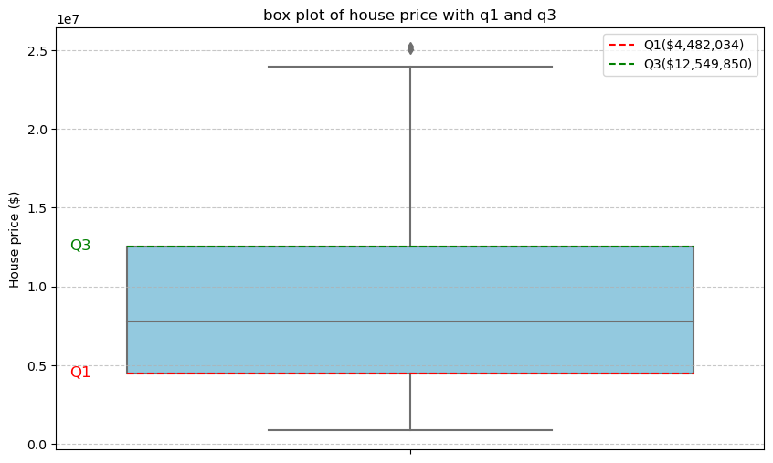
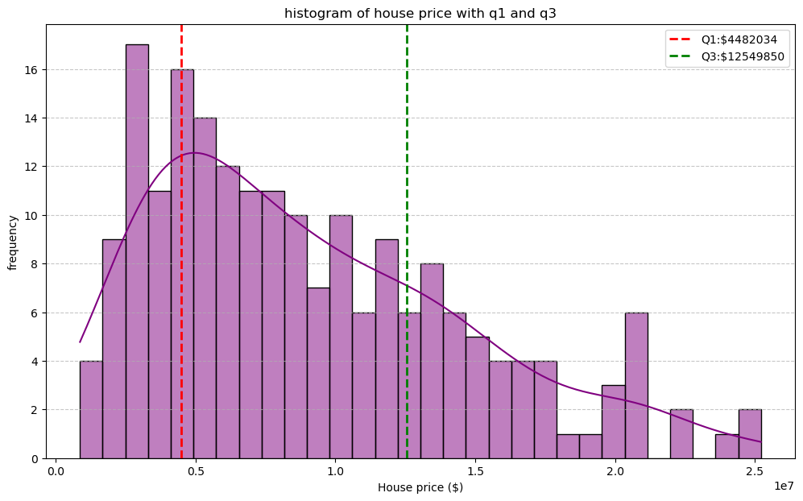

### PRG 1 : A dataset contains the prices of houses in a city. Find the 25th and 75th percentiles and calculate the interquartile range (IQR). How does the IQR help in understanding the price variability?


```python
import numpy as np
import matplotlib.pyplot as plt
import seaborn as sns
import pandas as pd
file_path=input("Enter the Data Set : ")
#file_path="/home/ailab/GA/exp1/house_prices_india.csv"
try:
    df=pd.read_csv(file_path)
    print("\n~~ Dataset loaded successfully~~")
    print(df.head())
    if df.shape[1]>1:
        print("\n available colums",list(df.columns))
        column_name=input("enter the column name containing house prices:")
    else:
        column_name=df.columns[0]
    house_prices=df[column_name].dropna().values
    house_prices=house_prices[house_prices>0]
    print(f"\n total no of valid house prices {len(house_prices)}")
    q1=np.percentile(house_prices,25)
    q3=np.percentile(house_prices,75)
    print(f"\nThe 25th percentile(Q1) of hosue price is:${q1:,.2f}")
    print(f"The 75th percentile (Q3) of house price is:${q3:,.2f}\n")
    iqr=q3-q1
    print(f"the interquartile (IQR) of house price is ${iqr:,.2f}\n")
except FileNotFoundError:
    print("File not found.please check the file path")
except pd.errors.EmptyDataError:
    print("File is empty or corrupted")
except Exception as e:
    print(f"An error occured :{e}")
plt.figure(figsize=(10,6))
sns.boxplot(y=house_prices,color='skyblue')
plt.hlines(q1,xmin=-0.4,xmax=0.4,colors='red',linestyles='dashed',label=f'Q1(${q1:,.0f})')
plt.hlines(q3,xmin=-0.4,xmax=0.4,colors='green',linestyles='dashed',label=f'Q3(${q3:,.0f})')
plt.text(-0.45,q1,'Q1',va='center',ha='right',color='red',fontsize=12)
plt.text(-0.45,q3,'Q3',va='center',ha='right',color='green',fontsize=12)
plt.title("box plot of house price with q1 and q3")
plt.ylabel("House price ($)")
plt.grid(axis='y',linestyle="--",alpha=0.7)
plt.legend()
plt.show()
plt.figure(figsize=(12,7))
sns.histplot(house_prices,kde=True,color='purple',bins=30)
plt.axvline(q1,color='red',linestyle='dashed',linewidth=2,label=f'Q1:${q1:.0f}')
plt.axvline(q3,color='green',linestyle='dashed',linewidth=2,label=f'Q3:${q3:.0f}')
plt.title("histogram of house price with q1 and q3")
plt.xlabel("House price ($)")
plt.ylabel('frequency')
plt.legend()
plt.grid(axis='y',linestyle="--",alpha=0.7)
plt.show()
```

    
    ~~ Dataset loaded successfully~~
          price        availability   location   size  total_sqft  balcony
    0   3069998  Under Construction  Hyderabad  1 BHK        1189        1
    1  11494560       Ready To Move  Bengaluru  3 BHK        1555        0
    2  13014855  Under Construction   Gurugram  3 BHK        1659        1
    3   4013190  Under Construction     Nagpur  2 BHK        1037        0
    4  12490569  Under Construction     Jaipur  3 BHK        1963        1
    
     available colums ['price', 'availability', 'location', 'size', 'total_sqft', 'balcony']
    enter the column name containing house prices:price
    
     total no of valid house prieces 200
    
    The 25th percentile(Q1) of hosue price is:$4,482,034.50
    The 75th percentile (Q3) of house price is:$12,549,849.75
    
    the interquartile (IQR) of house price is $8,067,815.25
    


    

    


    

    


## Understanding price variability with IQR
The **Interquartile Range (IQR)** is  a measure of statistical dispersion , representing the range between the **upper quartile (75th percentile)** and the **lower quartile (25th percentile)**. It encompasses the central; 50% of the data. In this context,
- **Robustness to Outliers:**  
    Unlike the full range(max-min), theIQR is not influenced by extreme values providing a more stable measure of spread. 
- **Concentration of Data:**   
    A smaller IQR suggest that prices are tightly clustered, indicating lower variability. 
- **Spread of Middle Values:**  
    A larger IQR suggest more variability in typical house prices. 
#### Thus, the IQR offers a **focused** and **robust** view of variability in housing pricing


