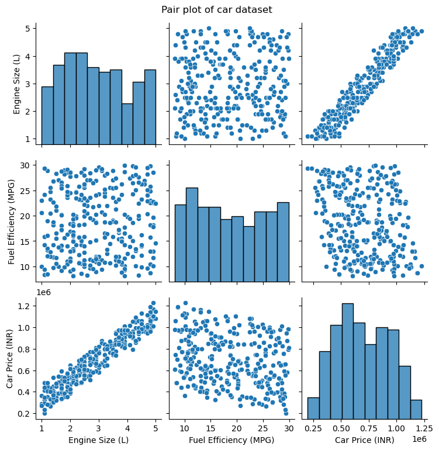
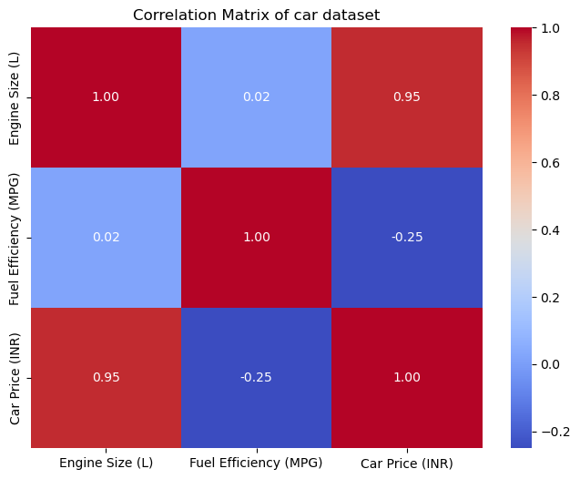

### Prg 3: A dataset contains information about car models, including the engine size (in Liters), fuel efficiency (miles per gallon), and car price. Use a pair plot or correlation matrix to explore the relationships between these variables. Which variables seem to have the strongest relationships, and what might be the practical significance of these findings?


```python
import pandas as pd
import seaborn as sns
import matplotlib.pyplot as plt


df = pd.read_csv("car_dataset.csv")

print("First 5 rows of dataset:")
print(df.head())
print("--Generating pair plot--")
sns.pairplot(df,diag_kind="hist")
plt.suptitle("Pair plot of car dataset",y=1.02)
plt.show()

corr_matrix=df.corr(numeric_only=True)
plt.figure(figsize=(8,6))
sns.heatmap(corr_matrix,annot=True, cmap="coolwarm", fmt=".2f")
plt.title("Correlation Matrix of car dataset")
plt.show()

print("\n Correlation Matrix")
print(corr_matrix)
corr_matrix
```

    First 5 rows of dataset:
         Company  Engine Size (L)  Fuel Efficiency (MPG)  Car Price (INR)
    0  Chevrolet              4.5                   14.0          1058934
    1        Kia              1.1                   29.4           200000
    2    Renault              2.4                   10.6           682393
    3    Hyundai              1.2                   13.2           437970
    4  Chevrolet              4.9                   22.6          1076890
    --Generating pair plot--


    

    


    

    


    
     Correlation Matrix
                           Engine Size (L)  Fuel Efficiency (MPG)  Car Price (INR)
    Engine Size (L)               1.000000               0.022267         0.954807
    Fuel Efficiency (MPG)         0.022267               1.000000        -0.249799
    Car Price (INR)               0.954807              -0.249799         1.000000


<div>
<style scoped>
    .dataframe tbody tr th:only-of-type {
        vertical-align: middle;
    }

    .dataframe tbody tr th {
        vertical-align: top;
    }

    .dataframe thead th {
        text-align: right;
    }
</style>
<table border="1" class="dataframe">
  <thead>
    <tr style="text-align: right;">
      <th></th>
      <th>Engine Size (L)</th>
      <th>Fuel Efficiency (MPG)</th>
      <th>Car Price (INR)</th>
    </tr>
  </thead>
  <tbody>
    <tr>
      <th>Engine Size (L)</th>
      <td>1.000000</td>
      <td>0.022267</td>
      <td>0.954807</td>
    </tr>
    <tr>
      <th>Fuel Efficiency (MPG)</th>
      <td>0.022267</td>
      <td>1.000000</td>
      <td>-0.249799</td>
    </tr>
    <tr>
      <th>Car Price (INR)</th>
      <td>0.954807</td>
      <td>-0.249799</td>
      <td>1.000000</td>
    </tr>
  </tbody>
</table>
</div>


**Interpretation**

**Strongest Positive Correlation:**
Between Engine Size (L) and Car Price (INR) **(0.955)**, indicating that larger engine sizes are strongly associated with higher car prices.

**Strongest Negative Correlation:**
Between Fuel Efficiency (MPG) and Car Price (INR) **(-0.250)**, showing a weak negative relationship where more fuel-efficient cars tend to be slightly less expensive.

**Other Negative Correlation:**
There is no other meaningful negative correlation in the matrix; the correlation between Engine Size (L) and Fuel Efficiency (MPG) is very close to zero **(0.022)**, indicating almost no linear relationship.

**Practical Significance**

**Manufacturers face a trade-off:** Larger engines → higher price but only a slight impact on fuel efficiency.

**Consumers may prefer:**

**High MPG cars (cost-efficient, environmentally friendly, and generally less expensive).**

**Large engines (luxury/performance, but significantly more expensive).****

This analysis helps car buyers and automobile companies understand the balance between price, performance, and fuel efficiency.


