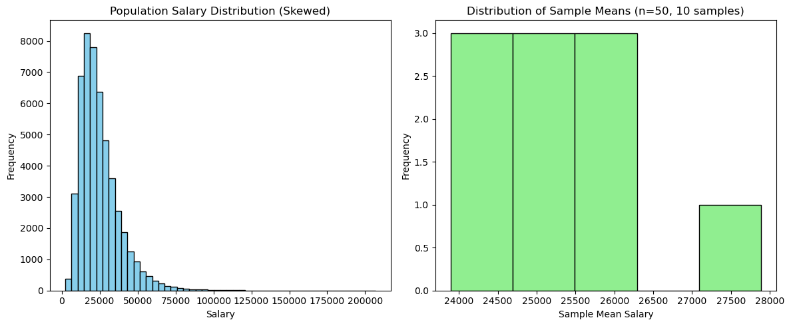

### Prg 4: You want to estimate the mean salary of software engineers in a country. You take 10 different random samples, each containing 50 engineers, and calculate the sample mean for each. Plot the distribution of these sample means. How does the Central Limit Theorem explain the shape of this sampling distribution, even if the underlying salary distribution is skewed?


```python
import numpy as np
import matplotlib.pyplot as plt
np.random.seed(42)
population_size = 50000
population_salaries = np.random.lognormal(mean=10, sigma=0.5, size=population_size)
sample_size = 50
num_samples = 10
sample_means = []
for _ in range(num_samples):
 sample = np.random.choice(population_salaries, size=sample_size, replace=False)
 sample_means.append(np.mean(sample))
plt.figure(figsize=(12,5))
plt.subplot(1,2,1)
plt.hist(population_salaries, bins=50, color='skyblue', edgecolor='black')
plt.title("Population Salary Distribution (Skewed)")
plt.xlabel("Salary")
plt.ylabel("Frequency")
plt.subplot(1,2,2)
plt.hist(sample_means, bins=5, color='lightgreen', edgecolor='black')
plt.title("Distribution of Sample Means (n=50, 10 samples)")
plt.xlabel("Sample Mean Salary")
plt.ylabel("Frequency")
plt.tight_layout()
plt.show()
print("Population Mean Salary:", np.mean(population_salaries))
print("Sample Means:", sample_means)
print("Mean of Sample Means:", np.mean(sample_means))
```


    

    


    Population Mean Salary: 24949.839715537575
    Sample Means: [25690.822648282097, 24903.92008443777, 25537.799649054818, 24100.5343465432, 23893.99408214238, 24485.759969962724, 27887.136718707574, 25335.89557004475, 25355.064466024, 26120.480704380727]
    Mean of Sample Means: 25331.140823958


### Interpretation

- The mean of the sample means (25,331.14) is very close to the true population mean (24,949.84), with only a small difference due to sampling variability.

- This demonstrates that **sample means are unbiased estimators** of the population mean.

- The **Central Limit Theorem** is in action: even though the population distribution is skewed, the sample means form a **normal-like distribution**.

